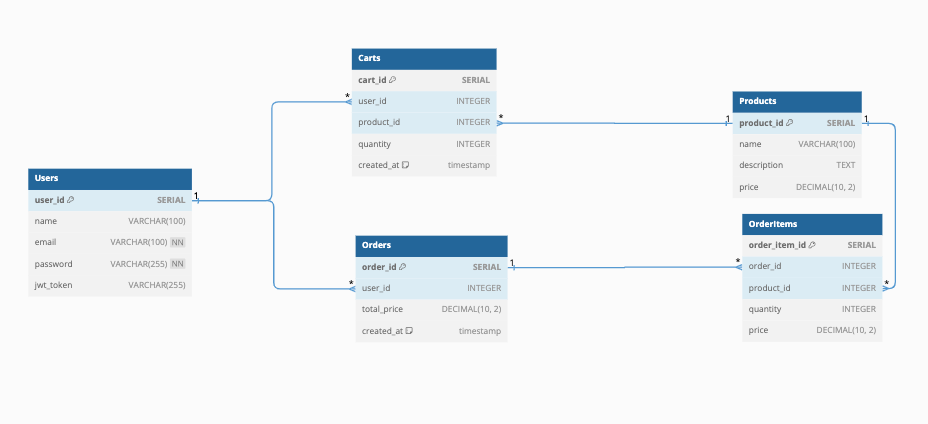

[](https://classroom.github.com/a/QyAtv8T-)
# Live-Code-3-Phase-2
## RULES
1. **Untuk kampus remote**: **WAJIB** melakukan **share screen**(**DESKTOP/ENTIRE SCREEN**) dan **unmute microphone** ketika Live Code
berjalan (tidak melakukan share screen/salah screen atau tidak unmute microphone akan di ingatkan).
2. Kerjakan secara individu. Segala bentuk kecurangan (mencontek ataupun diskusi) akan menyebabkan skor live code ini 0.
3. Waktu pengerjaan: **180 menit**
4. **Pada text editor hanya ada file yang terdapat pada repository ini**.
5. Membuka referensi eksternal seperti Google, StackOverflow, dan MDN diperbolehkan.
6. Dilarang membuka repository di organisasi tugas, baik pada organisasi batch sendiri ataupun batch lain, baik branch sendiri maupun branch orang
lain (**setelah melakukan clone, close tab GitHub pada web browser kalian**).
7. **Penilaian berbasis logika dan hasil akhir**. Pastikan keduanya sudah benar.

## Objectives
- Menguji pemahaman mengenai konsep REST API
- Menguji pemahaman dan kemampuan membuat REST API menggunakan Framework Echo
- Menguji pemahaman dan kemampuan integrasi REST API dengan implementasi SQL Database ( PostgreSQL ) menggunakan ORM GORM.

## Requirements
Anda diminta untuk membangun aplikasi e-commerce yang memungkinkan pengguna untuk membeli produk secara online. Anda diberi tugas untuk membangun backend RESTful API untuk mendukung fungsionalitas aplikasi. API ini seharusnya memungkinkan pengguna untuk menjelajahi produk, menambahkan produk ke keranjang mereka, melakukan pembayaran keranjang belanja, dan melihat riwayat pembelian mereka

- Buatlah database dan model berdasarkan ERD berikut:
   
   - Query DDL dan DML serta definisi entity/model sudah disediakan diakhir dokumen requirement ini. Diperbolehkan untuk mengubah ddl, dml dan definisi entity/model selama masih dapat memenuhi requirement fitur secara keseluruhan.

- Untuk memenuhi flow user diatas buatlah REST API yang memiliki endpoint sebagai berikut : 

  |Endpoint|Description|
  |---|---|
  |POST /users/register| Mendaftarkan user baru|
  |POST /users/login| Login user|
  |GET /users/carts| Menampilkan data cart user yang sedang login|
  |POST /users/carts| Menambahkan data pada cart user yang sedang login|
  |DELETE /users/carts/:id | Menghapus data pada cart user yang sedang login|
  |GET /users/orders| Menampilkan data order user yang sedang login|
  |POST /users/orders| Menambahkan data pada order user yang sedang login, dan juga menghapus seluruh data cart yang ada milik user yang sedang login|
  |GET /products| Menampilkan semua product|
  |GET /products/:id| Menampilkan product berdasarkan id|

- Pastikan anda mengikuti best practice REST API untuk http method dan response http status.

- Pastikan request dan response setiap endpoint mengikuti kontrak dokumentasi API yang telah disediakan

- Pastikan untuk handle negative casses dan edge cases yang memungkinkan terjadi, dan response sesuai dengan dokumentasi API yang terlah disediakan

- Untuk mempermudah proses pengerjaan, buatlah sebuah error contract beserta error handler nya.

- Pastikan untuk melakukan Deployment, dan sertakan url hasil deployment di akhir file ini

## Tech Stack Highlights
Live code ini memiliki bobot nilai sebagai berikut:

1. Framework Echo: Gunakan Echo sebagai web framework utama untuk mengimplementasikan routing, middleware, dan handling request/response.
2. PostgreSQL: Gunakan PostgreSQL sebagai database utama. Pastikan desain skema database sesuai dengan ERD yang diberikan.
3. GORM (ORM): Gunakan GORM untuk melakukan interaksi dengan database PostgreSQL. Implementasi CRUD harus dilakukan menggunakan GORM, termasuk migrasi, relasi antar tabel, dan manajemen transaksi.
4. Authentication dan Authorization: Implementasikan JWT untuk otentikasi dan otorisasi user pada endpoint yang membutuhkan proteksi. Pastikan hanya user dengan token yang valid yang dapat mengakses endpoint tersebut.

### Assignment Notes:

- Definisikan relasi antar entitas/table sesuai dengan requirement dan desain ERD yang telah anda buat
- Jangan terburu-buru dalam menyelesaikan masalah atau mencoba untuk menyelesaikannya sekaligus.
- Jangan menyalin kode dari sumber eksternal tanpa memahami bagaimana kode tersebut bekerja.
- Jangan menentukan nilai secara hardcode atau mengandalkan asumsi yang mungkin tidak berlaku dalam semua kasus.
- Jangan lupa untuk menangani negative case, seperti input yang tidak valid
- Jangan ragu untuk melakukan refaktor kode Anda, buatlah struktur project anda lebih mudah dibaca dan dikembangkan kedepannya, pisahkanlah setiap bagian kode program pada folder sesuai dengan tugasnya masing-masing.

### Additional Notes
Total Points : 100

Deadline : Diinformasikan oleh instruktur saat briefing LC. Keterlambatan pengumpulan livecode mengakibatkan skor LC 3 menjadi 0.

Informasi yang tidak dicantumkan pada file ini harap dipastikan/ditanyakan kembali kepada instruktur. Kesalahan asumsi dari peserta mungkin akan menyebabkan kesalahan pemahaman requirement dan mengakibatkan pengurangan nilai.

### SQL Query & Entity Definition
```sql
-- Create Users table
CREATE TABLE Users (
    user_id SERIAL PRIMARY KEY,
    name VARCHAR(100),
    email VARCHAR(100) UNIQUE NOT NULL,
    password VARCHAR(255) NOT NULL,
    jwt_token VARCHAR(255)
);

-- Create Products table
CREATE TABLE Products (
    product_id SERIAL PRIMARY KEY,
    name VARCHAR(100),
    description TEXT,
    price DECIMAL(10, 2)
);

-- Create Carts table, which contains user_id and product_id as foreign keys
CREATE TABLE Carts (
    cart_id SERIAL PRIMARY KEY,
    user_id INTEGER REFERENCES Users(user_id),
    product_id INTEGER REFERENCES Products(product_id),
    quantity INTEGER,
    created_at TIMESTAMP DEFAULT CURRENT_TIMESTAMP
);

-- Create Orders table, with a foreign key reference to Users
CREATE TABLE Orders (
    order_id SERIAL PRIMARY KEY,
    user_id INTEGER REFERENCES Users(user_id),
    total_price DECIMAL(10,2),
    created_at TIMESTAMP DEFAULT CURRENT_TIMESTAMP
);

-- Create OrderItems table to record individual items in each order, with foreign key references to Orders and Products
CREATE TABLE OrderItems (
    order_item_id SERIAL PRIMARY KEY,
    order_id INTEGER REFERENCES Orders(order_id),
    product_id INTEGER REFERENCES Products(product_id),
    quantity INTEGER,
    price DECIMAL(10,2)
);

-- Insert sample data into Users table
INSERT INTO Users (name, email, password, jwt_token) 
VALUES 
('Alice Johnson', 'alice.johnson@example.com', 'hashed_password1', 'jwt_token1'),
('Bob Smith', 'bob.smith@example.com', 'hashed_password2', 'jwt_token2');

-- Insert sample data into Products table
INSERT INTO Products (name, description, price) 
VALUES 
('Product1', 'Product1 Description', 100.00),
('Product2', 'Product2 Description', 200.00),
('Product3', 'Product3 Description', 300.00);

-- Insert sample data into Carts table
INSERT INTO Carts (user_id, product_id, quantity, created_at) 
VALUES 
(1, 1, 2, '2023-09-09 10:00:00'),
(1, 2, 1, '2023-09-09 10:05:00'),
(2, 3, 3, '2023-09-09 10:10:00');

-- Insert sample data into Orders table
INSERT INTO Orders (user_id, total_price, created_at) 
VALUES 
(1, 300.00, '2023-09-10 11:00:00'),
(2, 900.00, '2023-09-10 11:05:00');

-- Insert sample data into OrderItems table
INSERT INTO OrderItems (order_id, product_id, quantity, price) 
VALUES 
(1, 1, 2, 100.00),
(1, 2, 1, 200.00),
(2, 3, 3, 300.00);
```

### Deployment
Deployemnt URL: `__________` (isi dengan url deployment)


